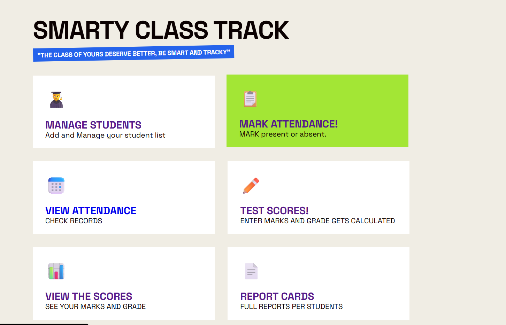

## SMARTY CLASS TRACK

It is a Project i made to bring automation in School register work which is boring.

It includes almost all basic Things a teacher do in register and get bored

In this app you dont have to use whitener backspace is enough

##How i Made It

It is a flask and jinja templated App Made By Html CSS and JS With python for logic.

I deployed it with railways and github for connection and a playable link.

I used intermediate HTML and CSS as that is what i know so far.

I used Python and Flask for core logic and i was a begginer in Flask But knew good python not ml but still more than basic.

This was How i made it

# FILES I MADE SO FAR

App.py

Readme.md

Requirements.txt

Procfile  

Templates/

add_question.html

attendance.html

index.html

quiz.html

quiz_result.html

report.html

report_card.html

scores.html

students.html

view_attendance.html

view_scores.html

Static/

script.js

style.css

Images/

attendbg.jpg

dashboard.png

quizbg.jpg

reportbg.jpg

reportcardbg.jpg

scorebg.jpg

studbg.jpg

viewscorebg.jpg

## What Exactly is the project-

A project Consisting of-

1.Attendance System to view and mark it.

2.Score system To view and mark it.

3.A report Card feature to View regular reports.

4.A quiz feature for creating,attending and marking it.

## SOME PREVIEWS 

#SCREENSHOT-

#Video-

##SOME THINGS TO NOTE-

#WHAT I USE AI FOR-

Css features like shadows and glassmorphism(Can be 1 or 2 more)

Python intendation fixing

flask and jinja templating help

## CREDITS-

My Laptop and charger

My Wifi

My code editor

For What i made

To submit to horizons ysws

To show that i rly code to my parents especially mum

Show my school staff 

## Who made it

Atharva Awasthi  

